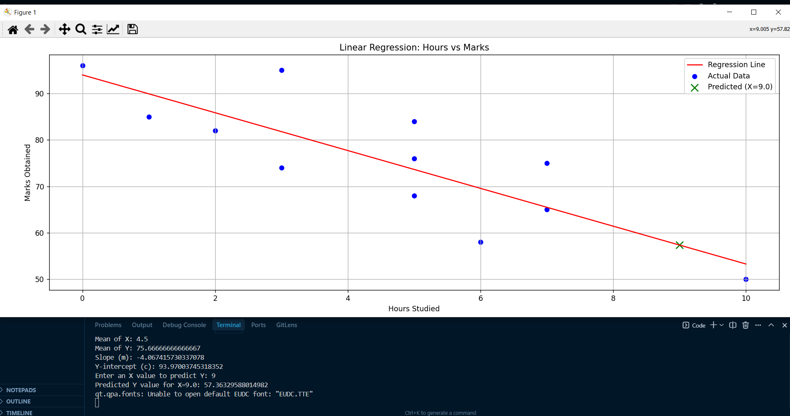

# ML_PRACTICALS_LAB

## 📘 Assignment 1: Linear Regression – Predicting Student Marks

This project builds a simple linear regression model from scratch to predict student marks based on hours studied.

### 🔹 File: `assignment1.py`

### 🔹 Input
- **X (Hours):** [0, 1, 2, 3, 3, 5, 5, 5, 6, 7, 7, 10]
- **Y (Marks):** [96, 85, 82, 74, 95, 68, 76, 84, 58, 65, 75, 50]

### 🔹 Method
- Calculates mean, slope (m), and intercept (c)
- Predicts using: `Y = mx + c`

### 📈 Visualization


---


---

# 📝 LAB 2: Logistic Regression for Insurance Prediction

This project uses **Logistic Regression** (implemented via `scikit-learn`) to predict whether an individual will purchase insurance based on their **age**.

## 💾 Project Files

* `LOGISTIC_REGRESSION_LAB_2.ipynb`: The Jupyter Notebook containing all the code for data loading, visualization, model training, evaluation, and prediction.
* `insurance_data_logistic`: The dataset used for training the model.

## 🚀 Model Details

### 1. Training & Features
* **Feature (X):** `age`
* **Target (y):** `bought_insurance` (0 = No, 1 = Yes)
* **Training Method:** Train-Test Split (80/20) and 5-Fold Cross-Validation.

### 2. Model Parameters
The trained model uses these parameters for the logistic function:
* **Weight ($\beta_1$ for Age):** $0.1201$
* **Bias ($\beta_0$ / Intercept):** $-4.8564$

$$\text{Probability} = \frac{1}{1 + e^{-(\mathbf{0.1201} \cdot \text{Age} - \mathbf{4.8564})}}$$

### 3. Evaluation Metrics
| Metric | Value |
| :--- | :--- |
| **Test Accuracy** | $\approx 83.33\%$ |
| **Average 5-Fold CV Accuracy** | $\mathbf{86.00\%}$ |

## 📊 Sigmoid Curve

The output of the notebook includes a visualization of the **Sigmoid Curve**, showing the increasing probability of buying insurance as age increases.

* Ages in the lower range (e.g., 20) have a low probability ($\approx 8\%$).
* Ages in the higher range (e.g., 60) have a high probability ($\approx 91\%$).


# 📝 Assignment: LAB 3 - LOGISTIC REGRESSION FROM SCRATCH

This project implements **Logistic Regression** entirely from **scratch** using NumPy, bypassing external libraries like `scikit-learn` to demonstrate the core mathematical model.

---

## 💻 Implementation

* **Model:** `LogisticRegressionScratch` class implementing the Sigmoid function, Binary Cross-Entropy Cost, and Gradient Descent.
* **Data:** `insurance_data_logistic` (Age $\rightarrow$ Bought Insurance 0/1).
* **Preprocessing:** The **Age** feature is **standardized** to ensure optimal convergence of the gradient descent algorithm.

---

## 📊 Results

| Metric | Value |
| :--- | :--- |
| **Learned Weights ($\beta$ for Scaled Age)** | $\mathbf{2.0971}$ |
| **Learned Bias ($\beta_0$ / Intercept)** | $\mathbf{0.1107}$ |
| **Training Accuracy** | $\approx 88.89\%$ |

The notebook includes plots demonstrating the decrease in the **Cost Function** over iterations and the final **Sigmoid Curve** fitted to the data. 

## 📌 Assignment 4: ID3 Decision Tree
### Objective
Implement and analyze the **ID3 Decision Tree algorithm** for classification tasks.

### Tasks
- Understand entropy and information gain.
- Build a decision tree using the ID3 algorithm.
- Train and test the model on a sample dataset.
- Evaluate performance using accuracy and confusion matrix.

### Expected Output
- A decision tree structure showing splits based on attributes.
- Classification results with evaluation metrics.

---

## 📌 Assignment 5: K-Nearest Neighbors (KNN)
### Objective
Implement and evaluate the **KNN algorithm** for classification.

### Tasks
- Implement KNN with varying values of *k*.
- Use distance metrics (Euclidean/Manhattan).
- Train and test the model on a sample dataset.
- Compare performance for different *k* values.

### Expected Output
- Classification results for different *k* values.
- Accuracy comparison table/graph.
- Observations on how *k* affects performance.


# Assignment 6: Linear Support Vector Machine (SVM)

## Overview

This project implements a **Linear Support Vector Machine (SVM)** classifier using **Python and scikit-learn**.
The model learns a straight-line decision boundary that separates two classes with maximum margin.

---

## Dataset

* Built-in **Iris dataset** (two classes used)
* Can be replaced with any **custom CSV dataset**

---

## Tools Used

* Python
* scikit-learn
* NumPy
* Pandas
* Matplotlib
* Google Colab

---

## Steps

1. Load dataset
2. Split into train and test sets
3. Apply feature scaling
4. Train Linear SVM
5. Predict and evaluate
6. Visualize decision boundary

---

## Model

```python
SVC(kernel='linear', C=1.0)
```

---

## Output

* Accuracy score
* Confusion matrix
* Classification report
* Decision boundary plot


---

# Assignment 7: Gradient Descent Optimization (From Scratch)

## Overview

This project implements **Gradient Descent optimization from scratch** for **Linear Regression** using Python and NumPy.
The model learns optimal parameters by minimizing **Mean Squared Error (MSE)** and successfully fits a regression line to noisy data.

---

## Key Features

* Vectorized Gradient Descent implementation
* Train / validation split
* Feature scaling
* Learning rate decay
* L2 regularization
* Early stopping
* Loss curve and model fit visualization

---

## Dataset

* Synthetic linear dataset with Gaussian noise
* Simulates real-world regression behavior


## Gradient Descent Update Rules

$$
w = w - \alpha \frac{\partial L}{\partial w}
$$

$$
b = b - \alpha \frac{\partial L}{\partial b}
$$

---

## Loss Function (MSE + L2 Regularization)

$$
L = \frac{1}{n} \sum_{i=1}^{n} (y_{\text{pred}} - y)^2 + \lambda \lVert w \rVert^2
$$

---

## Notation

* ( w ) : Weight parameter
* ( b ) : Bias parameter
* ( \alpha ) : Learning rate
* ( L ) : Loss function
* ( n ) : Number of samples
* ( \lambda ) : Regularization coefficient

---


## Output

* Smooth decrease in training and validation loss
* Best-fit regression line over noisy data
* Stable convergence without divergence


---

# Assignment 8: K-Means Clustering (From Scratch)

## Overview

This project implements the **K-Means clustering algorithm from scratch** using Python and NumPy.
The algorithm groups unlabeled data into **k clusters** by minimizing the distance between data points and their assigned cluster centroids.

No built-in `sklearn.cluster.KMeans` is used.

---

## Features

* Pure NumPy implementation
* Random centroid initialization
* Euclidean distance computation
* Convergence check using centroid movement
* Cluster and centroid visualization

---

## Dataset

* Synthetic 2D dataset with three natural clusters
* Generated using Gaussian distributions

---

## Algorithm Steps

1. Choose number of clusters ( k )
2. Initialize centroids randomly
3. Assign each data point to the nearest centroid
4. Update centroids as the mean of assigned points
5. Repeat until centroids converge

---


## Objective Function

The K-Means algorithm minimizes:

$$
J = \sum_{i=1}^{k} \sum_{x \in C_i} \lVert x - \mu_i \rVert^2
$$

---

## Where

* ( C_i ) : Cluster ( i )
* ( \mu_i ) : Centroid of cluster ( i )


---

## Output

* Final cluster assignments
* Learned centroids
* Visual plot of clusters and centroids


