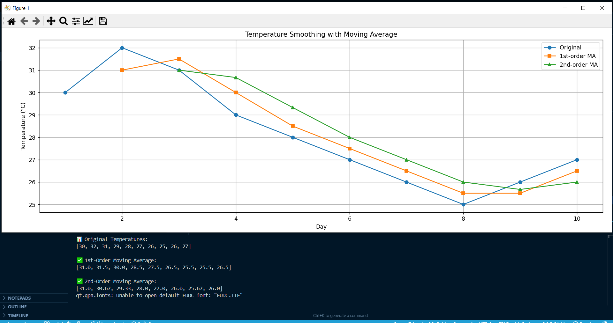

# ML_PRACTICALS_LAB

## 📘 Assignment 1: Linear Regression – Predicting Student Marks

This project builds a simple linear regression model from scratch to predict student marks based on hours studied.

### 🔹 File: `assignment1.py`

### 🔹 Input
- **X (Hours):** [0, 1, 2, 3, 3, 5, 5, 5, 6, 7, 7, 10]
- **Y (Marks):** [96, 85, 82, 74, 95, 68, 76, 84, 58, 65, 75, 50]

### 🔹 Method
- Calculates mean, slope (m), and intercept (c)
- Predicts using: `Y = mx + c`

### 📈 Visualization


---

## 📗 Assignment 2: Moving Average Filter – Temperature Smoothing

This script applies 1st-order and 2nd-order moving average filters to daily temperature data.

### 🔹 File: `Moving_average.py`

### 🔹 Features
- Smooths fluctuations in temperature readings
- Visualizes original vs filtered data using Matplotlib

### 📊 Output Sample
```
Original: [30, 32, 31, 29, 28, 27, 26, 25, 26, 27]
1st-order MA: [31.0, 31.5, 30.0, 28.5, 27.5, 26.5, 25.5, 25.5, 26.5]
2nd-order MA: [31.0, 30.67, 29.33, 28.0, 27.0, 26.0, 25.67, 26.0]
```

### 📈 Visualization

